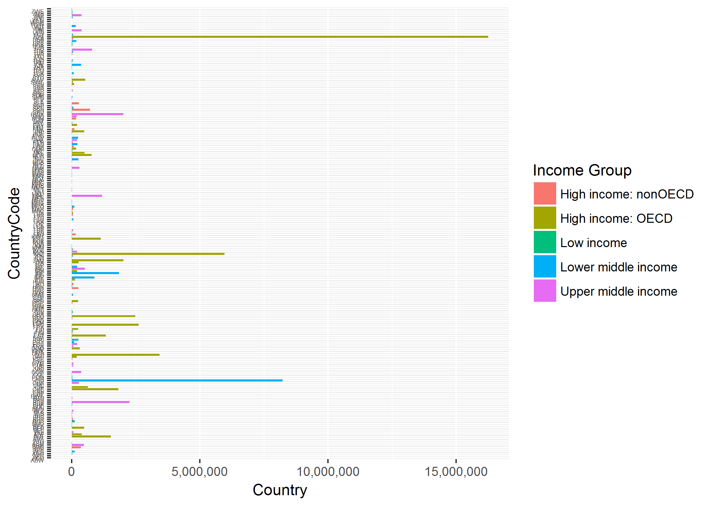
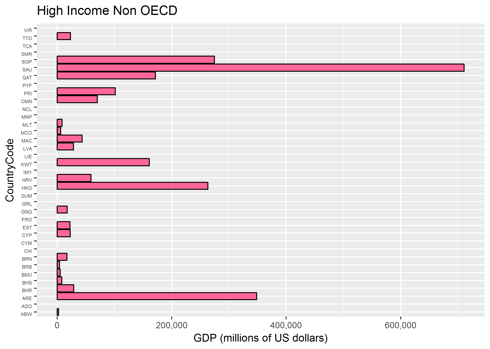
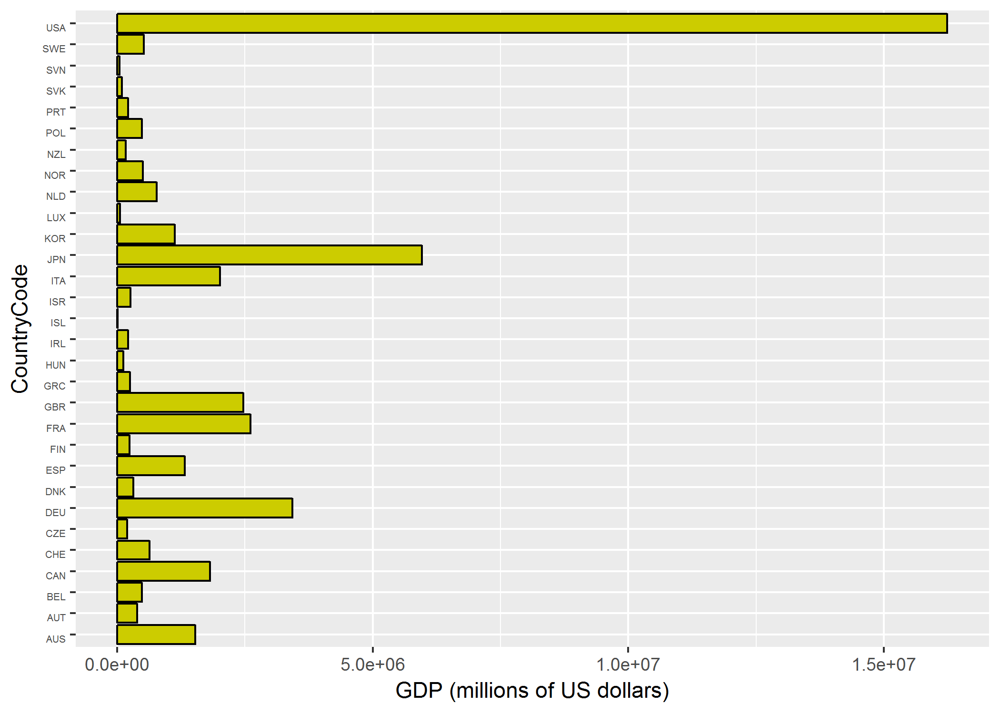
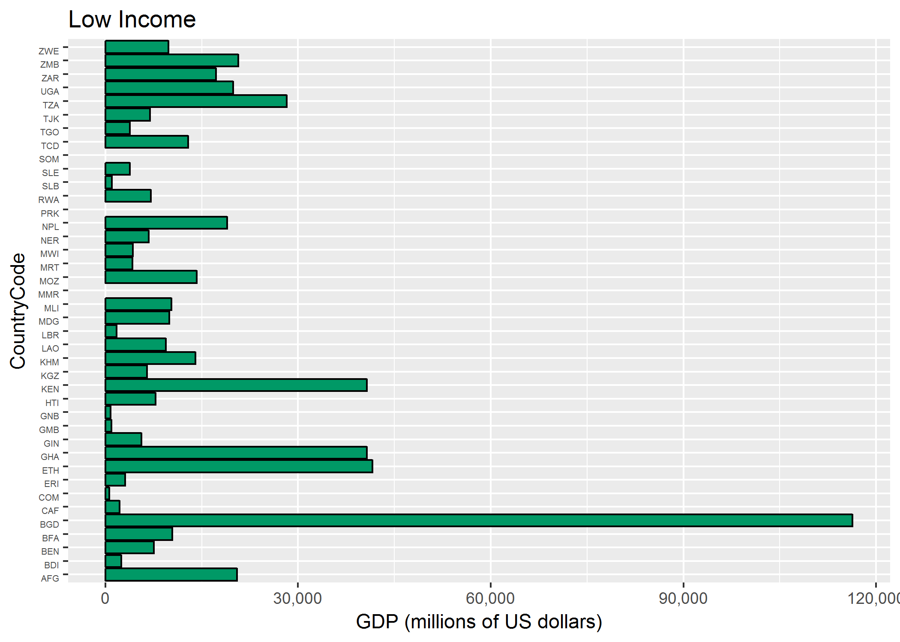
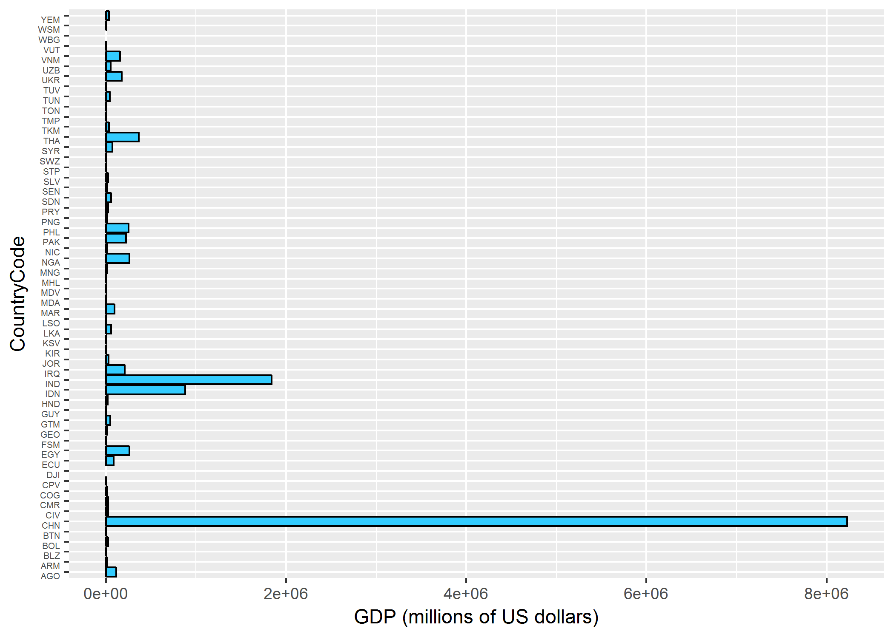
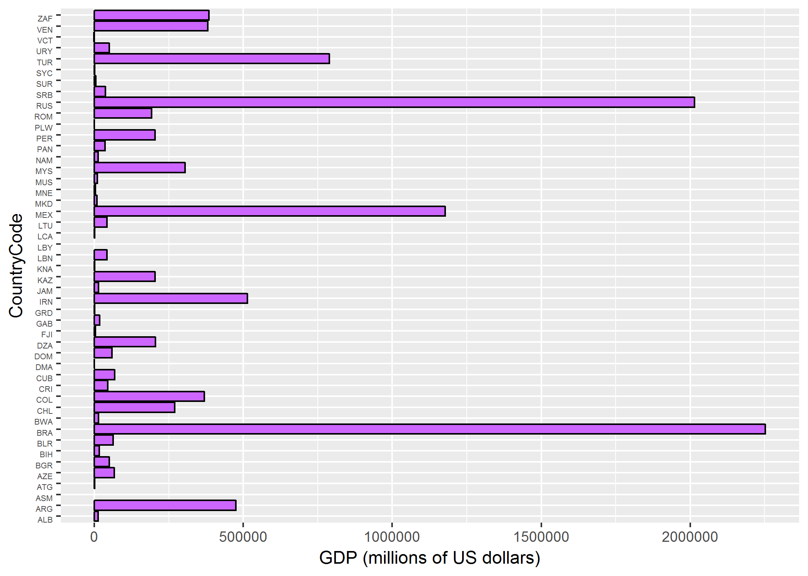

CaseStudy1\_Rmd
================
Austin Hancock - Ernesto Carrera - Matthew Przybyla
7/9/2017

Introduction
============

The World Bank is an international financial institution that provides financial and technical assistance to developing countries around the world. To this end, they provide a large array of free data sources ranging from agriculture to education that allow people to dive into the world’s development challenges.

One such area that the World Bank data helps us to look into is the relationship between Gross Domestic Product (GDP) and Income Group of countries. To better understand development indicators, the World bank has categorized income groups as: High Income: nonOECD, High Income: OECD, Low Income, Lower Middle Income, and Upper Middle Income. The separation of nonOECD and OECD represents the involvement of a particular country in the Organisation for Economic Co-operation and Development, an intergovernmental organization created to stimulate economic progress.

To understand the relationship between GDP and Income Group, we have taken GDP data from the World Bank for the year 2012 and applied the Income Group categories, as described above, to see the correlation, if any, of GDP rankings and income levels of countries.

R Markdown
----------

The code for downloading, tyding and merging data in a R Markdown file. The files are included in a makefile format

``` r
# Downloading
source("Download.R")

# Cleaning
source("Cleaning.R")

# Merging the data into a Data frame object testMerge
source ("Merging.R")
```

``` r
match<-testMerge[which(!is.na(testMerge$`CountryCode`)),1]
```

The answers to the questions of interest are:

1.  The number of countries that match are: 210

``` r
## 2 - Sort Ascending GDP DATA

testMerge <- testMerge[order(testMerge$`GDP (millions of US dollars)`, decreasing = FALSE),]
```

1.  The 13th country with the GDP (ascended order) is: St. Kitts and Nevis

``` r
# Retrieving the data for the income group: High income: OECD
tHiOE<-subset(x=testMerge,`Income Group`=='High income: OECD')
HiInOecd <- round(mean(tHiOE$`Rank`,na.rm=TRUE),2)
```

1.  The average GDP rankings for the "High Income OECD" is: 32.97

``` r
# Retrieving the data for the income group: High income: nonOECD
tHiNOE<-subset(x=testMerge,`Income Group`=='High income: nonOECD')
HiInNOecd <- round(mean(tHiNOE$`Rank`,na.rm=TRUE),2)
```

The average GDP rankings for the "High Income nonOECD" is: 91.91

``` r
# Number of missing values for High income: nonOECD
CountMissing_HiNOE<-length(which(is.na(tHiNOE$`Rank`)))
CountMissing_HiNOE
```

    ## [1] 14

The number of missing rankings for the group "High Income nonOECD" is: 14

1.  Plot the GDP for all the countries.

``` r
## Plot the GDP for all of the countries, color plot by Income Group
suppressWarnings(library(ggplot2))
allPlot <- ggplot(testMerge, aes(x=`CountryCode`, y=`GDP (millions of US dollars)`, fill=`Income Group`)) +
  geom_bar(stat='identity') +
  coord_flip() +
  theme(axis.text.y = element_text(vjust = 1, size = 4)) +
  scale_y_continuous(labels = scales::comma)


# Saving the plot in png format to be displayed in Github
suppressMessages(suppressWarnings(ggsave(filename = "all.png", plot = allPlot)))
```



``` r
# We create different dataframes for each income group for individual graphs

HighIncomeNonOECD <- testMerge[which(testMerge$`Income Group` == 'High income: nonOECD'),]
HighIncomeOECD <- testMerge[which(testMerge$`Income Group` == 'High income: OECD'),]
LowIncome <- testMerge[which(testMerge$`Income Group` == 'Low income'),]
LowerMiddleIncome <- testMerge[which(testMerge$`Income Group` == 'Lower middle income'),]
UpperMiddleIncome <- testMerge[which(testMerge$`Income Group` == 'Upper middle income'),]
```

4.1) Plot the GDP for countries with HighIncomeNonOECD

``` r
HighIncomeNoneOECDPlot <- ggplot(HighIncomeNonOECD, aes(x=`CountryCode`, y=`GDP (millions of US dollars)`, fill=`Income Group`)) +
  geom_bar(stat='identity', fill = '#FF6699', color = 'black') +
  coord_flip() +
  theme(axis.text.y = element_text(vjust = 1, size = 5)) +
  scale_y_continuous(labels = scales::comma) +
  labs(title = 'High Income Non OECD')

suppressMessages(ggsave(filename = "HighIncomeNonOECD.png", plot = HighIncomeNoneOECDPlot)) 
```

    ## Warning: Removed 14 rows containing missing values (position_stack).



4.2) Plot the GDP for countries with HighIncomeOECD

``` r
HighIncomeOECDPlot <- ggplot(HighIncomeOECD, aes(x=`CountryCode`, y=`GDP (millions of US dollars)`, fill=`Income Group`)) +
  geom_bar(stat='identity', fill = '#CCCC00', color = 'black') +
  coord_flip() +
  theme(axis.text.y = element_text(vjust = 1, size = 5)) +
  scale_y_continuous(labels = scales::comma) +
  labs(title = 'High Income OECD')

suppressMessages(ggsave(filename = "HighIncomeOECD.png", plot = HighIncomeOECDPlot))
```



4.3) Plot the GDP for countries with LowIncome

``` r
LowIncomePlot <- ggplot(LowIncome, aes(x=`CountryCode`, y=`GDP (millions of US dollars)`, fill=`Income Group`)) +
  geom_bar(stat='identity', fill = '#009966', color = 'black') +
  coord_flip() +
  theme(axis.text.y = element_text(vjust = 1, size = 5)) +
  scale_y_continuous(labels = scales::comma) +
  labs(title = 'Low Income')

suppressMessages(ggsave(filename = "LowIncome.png", plot = LowIncomePlot))
```

    ## Warning: Removed 3 rows containing missing values (position_stack).



4.4) Plot the GDP for countries with LowerMiddleIncome

``` r
LowerMiddleIncomePlot <- ggplot(LowerMiddleIncome, aes(x=`CountryCode`, y=`GDP (millions of US dollars)`, fill=`Income Group`)) +
  geom_bar(stat='identity', fill = '#33CCFF', color = 'black') +
  coord_flip() +
  theme(axis.text.y = element_text(vjust = 1, size = 5)) +
  scale_y_continuous(labels = scales::comma) +
  labs(title = 'Lower Middle Income')


suppressMessages(ggsave(filename = "LowerMiddleIncome.png", plot = LowerMiddleIncomePlot))
```

    ## Warning: Removed 2 rows containing missing values (position_stack).



4.5) Plot the GDP for countries with UpperMiddleIncome

``` r
UpperMiddleIncomePlot <- ggplot(UpperMiddleIncome, aes(x=`CountryCode`, y=`GDP (millions of US dollars)`, fill=`Income Group`)) +
  geom_bar(stat='identity', fill = '#CC66FF', color = 'black') +
  coord_flip() +
  theme(axis.text.y = element_text(vjust = 1, size = 5)) +
  scale_y_continuous(labels = scales::comma) +
  labs(title = 'Upper Middle Income')


suppressMessages(ggsave(filename = "UpperMiddleIncome.png", plot = UpperMiddleIncomePlot))
```

    ## Warning: Removed 2 rows containing missing values (position_stack).



``` r
##5- Cut the GDP ranking into 5 SEPARATE QUANTILE GROUPS
## Count the Missing Values in `Rank`


# Count the number of missing obervations in Rank
CountMissing_Rank<-length(which(is.na(testMerge$`Rank`)))
CountMissing_Rank
```

    ## [1] 21

``` r
# Remove missing values in the ranking Rank: 
Ranks_GDP<-testMerge[which(!is.na(testMerge$`Rank`)),]


Ranks_GDP <- within(Ranks_GDP
                   ,quantile <- as.integer(cut(`GDP (millions of US dollars)`, quantile(`GDP (millions of US dollars)`, probs=0:5/5), include.lowest=TRUE)))


# Get the 38 nations with the highest income
Ranks_GDP_<-subset(Ranks_GDP[,c("Rank","Economy","GDP (millions of US dollars)","Income Group","quantile")],quantile==5 & `Income Group`=="Lower middle income")

# Number of 38 nations with the highest GDP ranking and have "lower middle income" is:
num38LowMid<- length(Ranks_GDP_[,1])
# The 38 nations with the highest GDP and "lower middle income" are:
Ranks_GDP_ <- Ranks_GDP_[order(Ranks_GDP_$`GDP (millions of US dollars)`, decreasing = TRUE),]
Ranks_GDP_[,'Economy']
```

    ## [1] "China"            "India"            "Indonesia"       
    ## [4] "Thailand"         "Egypt, Arab Rep."

1.  Cutting GDP ranking into 5 separate quantile groups. The number of coutries that are lower middle income but among the highest GDP is: 5

Note: There are 21 countries not ranked.

Conclusion
==========

From the data we gathered, we found that the countries within the High Income: OECD category had a higher GDP than the other categories. This may not come as much as a surprise, as you would assume a country with high income to also have high GDP. However, you can see that there are some countries that fall into different income groups that have a high GDP; China, Brazil, and Russia to name a few. What’s going on here? The answer to this question stems from what GDP represents. A country’s GDP is the dollar value of all the goods and services the country produced in a certain time period. So, GDP represents a country’s economy as a means of production, but is not a direct reflection of how the citizens of that country are compensated. The instances of countries with high GDP and low income levels tells us that while the production in the country is high, the income level of its workers is low.
